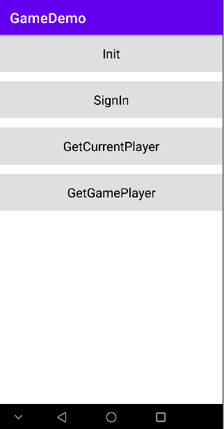

# Game Demo
English | [中文](https://github.com/HMS-Core/hms-game-demo/blob/master/README_ZH.md)
## Contents

 * [Introduction](#Introduction)
 * [Environment Requirements](#Environment-Requirements)
 * [Getting Started](#Getting-Started)
 * [Result](#Result)
 * [License](#License)

## Introduction
   The sample code integrates the sign-in and addiction prevention APIs of Game Service to provide a sample program for your reference and use.

## Environment Requirements
   Android SDK (API level 23 or later) and JDK 1.8 or later

## Getting Started

   1. Verify that Android Studio is ready for app development. Open the sample project with Android Studio. Prepare a device running the latest Huawei Mobile Services (HMS).
   2. Register a [HUAWEI ID](https://developer.huawei.com/consumer/en/).
   3. Create an app and configure app information in AppGallery Connect.
   For details, please refer to [Game Service Development Preparations](https://developer.huawei.com/consumer/en/doc/development/HMSCore-Guides/config-agc-0000001050166285).
   4. Import the demo to Android Studio 3.0 or a later version.
   5. Configure the sample code.
   (1) Download the **agconnect-services.json** file of your app from AppGallery Connect, and add the file to the root directory (**\app**) of the sample project.
   (2) Open the app-level **build.gradle** file of the same project and set **applicationId** to your app package name.
   (3) Configure the signature in the sample project and configure the signature certificate fingerprint in AppGallery Connect.
   6. Run the sample code on the Android device.

## Result
   

## License
   The sample code is licensed under [Apache License, version 2.0](https://www.apache.org/licenses/LICENSE-2.0).
